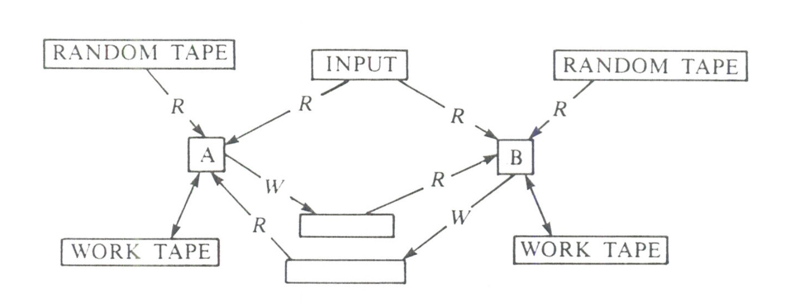

# THE KNOWLEDGE COMPLEXITY OF INTERACTIVE PROOF SYSTEMS

$...$

## 2. 交互式证明系统。

直观上讲，我们对一个高效的 **定理证明过程** 应该有些什么要求呢？

* （1）可以“证明”一个真定理。
* （2）不应该“证明”一个假定理。
* （3）传递“证明”的过程应该是高效的。也就是说，无论用了多少时间来得出这个证明，它的正确性应该能够高效地被验证。

$...$

验证者将是一个这样一个机器，它能够与证明者进行消息（字符串）交换，其执行时间是的 **概率多项式时间** 的，这里的多项式是 **公共输入** 的长度的多项式。

### 注
>所谓 **公共输入** 见下文

在证明系统中引入概率的同时，我们也将放宽对“证明”的定义。我们的验证者可能以非常小的概率错误地相信一个假命题。对于每个正的常数 $k$ 以及足够大的输入规模 $n$ ，错误概率小于 $n^{-k}$ 。

### 注
>对于任何正的常数 $k$ ，总能找到一个依赖于 $k$ 的常数 $N(k)$ ，只要输入规模 $n > N(k)$ ，错误概率必将小于 $n^{-k}$ 。

### 2.1 交互式图灵机和协议

定义：**交互式图灵机（Interactive Turing Machine，ITM）** 是一种配备有只读输入带、工作带、随机带、一个只读通信带和一个只写通信带的图灵机。随机带包含一个无限长的随机比特序列，但是只能从左到右被读取。我们说一个 **交互式图灵机** 掷硬币，其实是说它读取了自己随机带上的下一个随机比特。

图1: 一个交互协议，双向箭头代表可读可写头，R箭头代表只读头，W箭头代表只写头

定义：一个 **交互协议** 是由两个 **交互式图灵机** A和B组成的有序对，其中A和B共享相同的输入带，B的只写通信带是A的只读通信带，反之亦然（注：参考图1）。机器A没有计算上的限制，而机器B的计算时间受限于公共输入长度的多项式。这两台机器轮流处于活跃状态，B先行动。在A的活跃阶段（注：B类似，因此不重复描述），机器A首先使用它的输入带、工作带、通信带和随机带进行一些内部计算；然后，在它的只写通信带上写入一个字符串（给B）。A的第i个消息是A在第i个活跃阶段期间写入其通信带的整个字符串。一旦机器A写入其消息，它就会停止活动。然后，除非协议已经终止，机器B将变为活跃状态。任何一台机器都可以通过在活跃阶段不发送任何消息来终止协议的计算。机器B通过输出“accept“或“reject”并终止协议来接受（或拒绝）其输入。机器B的计算时间是B在所有活跃阶段中的计算时间之和，这个时间受限于输入长度的多项式。这里输入长度可以表示为 $|x|$ 。

### 注
>机器B输出的"accept"或"reject"，是输出到哪里呢？是只写通信带吗？怎么终止？不是没有输出才终止么？抑或是特殊处理？就是B写入了accept或者reject也当作终止？

### 2.2 交互证明系统

定义：设 $L$ 是一个语言，定义在 $`{\{0,1\}}^*`$ 上。设(A, B)是一个交互协议。如果满足以下条件，我们称(A, B)是 $L$ 的交互证明系统：

* （1）对于每个 $k$ ，对于足够大的输入 $x \in L$ ，将其输入到(A, B)，则B必将能够终止，并以至少 $1 - {|x|}^{-k}$ 的概率接受 $x$ 。（这里的概率计算基于A和B的硬币投掷，即读取的随机比特）

* （2）对于每个 $k$ ，对于足够大的输入 $x \notin L$ ，对于任意的 **ITM** A' ，将 $x$ 输入到(A', B)，则B以至多 ${|x|}^{-k}$ 的概率接受。（这里的概率计算基于A'和B的硬币投掷）

### 原文注1
> 通过多次重复上述协议，并选取占多数的结果作为结论，其错误概率可以减小到小于 $2^{-|x|}$ 。

我们现在论证，这个定义符合我们对于高效证明系统的直观要求。条件（1）基本上表示，如果 $x \in L$ ，那么B会以极大的概率接受。条件（2）表示，如果 $x \notin L$，则不存在能够以 **显著** (nonnegligible) 概率成功说服B接受的策略。事实上，B不需要信任（或知道）与其交互的机器的程序，它只需相信自己硬币投掷的随机性即可。

$...$

我们将 **IP** （ **交互多项式时间** ）定义为存在交互证明系统的语言类。

$...$

## 3. 零知识（Zero-knowledge）。

对于零知识，我们将给出一个不仅限于 **交互证明系统** 的，更为一般的定义。对于任何交互协议（A, B），无论它是不是语言 $L$ 的证明系统，我们都将定义该协议是零知识的具体含义。实际上，这个定义甚至不会涉及到B。正如我们将看到的，零知识表明对于每个多项式时间的机器B'，当输入为 $x \in L$ 时，它与A进行交互的过程中，B'在其所有带上“看到”的数据的分布，与某个可以在多项式时间内从 $x$ 计算得到的分布相比，是 **无法区分** 的。因此，我们首先关注随机变量的 **不可区分性** 的概念。

### 注：一些关于B能够从交互中获取知识的直观理解
>
> 为了更直观的理解，我们稍微修改一下交互模型：取消公共输入带，转而给A和B分别给一个输入带。A的输入带某种程度上可以看作是A的秘密，不能被B看见。至于B的输入带，也不用给A看见。
> 
> 对于A的输入带上的东西，我们设其为 $x$ 。交互之前，B完全不知道 $x$ 是什么。或者，对于B来说，可以假定 $x$ 是一个随机变量，其分布符合某种先验假设，而其随机性的来源可以是某种假想的 $bits_{x}$ 。注意，对A来说，$x$ 是确定的，对B来说， $x$ 是一个基于随机比特 $bits_{x}$ 生成的随机变量，这两者并不矛盾。因此在后续讨论中，要注意区分。默认情况下，对B来说，我们假设 $x$ 是某个 $`\{0,...,n-1\}`$ 的平均分布。
>
> 交互之后，相比交互之前，B在其所有带上看到的，就是它能够获得的所有 **新数据** 。要说B通过交互获取了什么新知识，那这些新知识也必然基于这些新数据。而这些数据包括：随机带和通信输入带。而B的输入带则可以认为是B在交互之前就已经知道的先验知识。工作带以及通信输出带上的内容，实际上是由B基于随机带、通信输入带以及输入带，在多项式时间内计算出来的，因此可以认为并不是第一手的新数据。这里我们强调，我们可以合理的认为，如果B能够在确定多项式时间内，基于数据 $D_{in}$ 计算出数据 $D_{out}$ ，则数据 $D_{out}$ 并不比数据 $D_{in}$ 多出什么新知识。作为特例，B在和A交互之前，就能够根据其先验知识，在多项式时间内计算出来的任何东西，都仍然是先验知识。
>
> B在交互过程中获取的新知识，可以是以其获取的新数据，附加先验知识，通过多项式时间计算出来的任何数据或者命题。
> 
> **例子1**
>
> 考虑一个没有使用随机性的(A,B)系统。为了明确讨论，我们将B的所谓知识计算函数 $Z$ ，定义为计算B在交互之后对A的输入带上的 $x$ 的可能情况的判断。在没有任何交互之前，如前所述，我们可以合理的认为，对于B来说， $x$ 完全未知，因此其分布应该是 $`\{0,...,n-1\}, n>0`$ 上的平均分布。那么在交互之后，B有没有获取新知识，就可以简单的等价于， $Z$ 算法计算出的 $x$ 的分布情况，是否等价于 $`\{0,...,n-1\}`$ 的平均分布。如果相等，那就是没有新知识。如果不等，那就是有了新知识。本例中，我们设定(A,B)的交互协议如下： 
>
>>1. B发送"hello"信息； 
>>2. A发送"1+1=2"信息；
>>3. B结束协议。
>
>在这个看似搞笑的简单协议中，我们理应认为，在交互过程中，B不应学到任何关于 $x$ 的新知识，也就是说，其知识计算函数 $Z$ ，在输入为 ("1+1=2") 的情况下，其输出依然是： $x$ 是 $`\{0,...,n-1\}`$ 上的均匀分布。我们这里可以换一种说法，这个协议之所以看起来很搞笑，是因为作为 $Z$ 的输入的数据，太简单了，B完全可以在不和A进行交互的情况下自己快速计算出来（甚至都不用计算）。这里再次提示我们，B自己能够依据其先验知识算出来的，都不算做新知识，至少不能算作从A处学到的新知识。
>
> **例子2**
>
> 类似例子1，但是允许B使用随机带上的随机比特。设定其交互协议如下：
>
>> 1. B发送随机数 $`r \in \{0,1\}`$ ；
>> 2. A发送 $r$ ； 
>> 3. B结束交互。
>
> 这个协议仍然是简单到无聊。我们应该合理的认为，交互完成之后，B不会学到任何新的知识，尤其是关于 $x$ 的知识。
>
> 在这里，B没有学到新知识的根源，仍然是，所谓的新数据，是B能够通过其先验数据，以及自己的随机带能够计算出来的。还是那句话，B能够自己计算出来的，都不能算作知识的来源。知识在这里，B计算知识的时候，不仅仅依赖于先验知识，还输入了自己的随机带的内容。
>
> **例子3**
>
> 类似例子1，但是我们允许A使用随机带上的随机比特。出于简单考虑，我们假设B不使用随机带。设定交互协议如下：
>
>> 1. B发送"hello"; 
>> 2. A随机选择一个 $`r \in \{0,1\}`$ ，并发送 $s=x+r \mod 2$ 给B; 
>> 3. B结束交互。
>
> 为了分析的简单，我们假设 $n=4$ 。那么，上述过程，B到底有没有学到新知识呢？或者明确一点，B到底有没有学到关于 $x$ 的新知识呢？按照我们之前对知识的看法，我们实际上要问的是，在交互之后，B关于 $x$ 的分布的合理判断（称为后验知识），相对于交互之前对于 $x$ 的分布的判断（称为先验知识），有没有发生变化。如果有，那就是学到了新知识，如果没有，那就是没有学到新知识，也就是零知识。这里的先验知识很简单，那就是 $x$ 是 $`\{0,...,n-1\}`$ 的平均分布。对于后验知识，我们可以使用贝叶斯公式。
>
> $$` 
\begin{align*}
& Pr(x=i|s=j) \\ 
=& \frac{Pr(x=i,s=j)}{Pr(s=j)} \\ 
=& \frac{Pr(s=j|x=i) * Pr(x=i)}{ \displaystyle\sum_{k=0}^{n-1} Pr(s=j|x=k) * Pr(x=k)} 
\end{align*} 
`$$
>
>将贝叶斯公式引入上面的例子的话，容易得到
>
> $$`
\begin{align*}
& Pr(x=i|s=j) \\
=& \frac{Pr(s=j|x=i) * Pr(x=i)}{ \displaystyle\sum_{k=0}^{n-1} Pr(s=j|x=k) * Pr(x=k)} \\
=& \frac{\frac{1}{2} * \frac{1}{4}}{\displaystyle\sum_{k=0}^{3}  \frac{1}{2} * \frac{1}{4}} \\
=& \frac{1}{4}
\end{align*}
`$$
>
> 也就是说，无论交互之后，B看到的 $`s \in \{0,1\}`$ 是多少，它对 $x$ 能够做出的后验判断，依然是一个平均分布，这和先验判断并无二致。因此，我们可以合理的认为这个交互过程是零知识的。
>
> **例子4**
>
> 稍微修改一下例子3，我们可以得到一个有知识的交互。我们不再随机选择 $r$ ，而不是以 $3/4$ 的概率选择 $r=0$ ，而 $1/4$ 的概率选择 $r=1$ 。仍然套入上面的公式，我们将得到
>
> $$`
\begin{align*}
& Pr(x=0|s=0) \\
=& \frac{Pr(s=0|x=0) * Pr(x=0)}{ \displaystyle\sum_{k=0}^{n-1} Pr(s=0|x=k) * Pr(x=k)} \\
=& \frac{\frac{3}{4} * \frac{1}{4}}{\frac{3}{4} * \frac{1}{4}  + \frac{1}{4} * \frac{1}{4} + \frac{3}{4} * \frac{1}{4} + \frac{1}{4} * \frac{1}{4} } \\
=& \frac{3}{8}
\end{align*}
`$$
>
>类似的别的概率将是
>
|  | $x=0$ | $x=1$ | $x=2$ | $x=3$
|-:|-:|-:|-:|-:|
| $s=0$ | $\frac{3}{8}$ | $\frac{1}{8}$ | $\frac{3}{8}$ | $\frac{1}{8}$
| $s=1$ | $\frac{1}{8}$ | $\frac{3}{8}$ | $\frac{1}{8}$ | $\frac{3}{8}$
>
> 不难看出，交互之后，无论 $s=0$ 还是 $s=1$ ，B关于 $x$ 的后验知识已经发生了变化。比如，如果 $s=0$ ，B可以合理的判断 $x$ 更有可能是一个偶数。因此，我们应该合理的认为，上面这个交互过程，**不是零知识的**。
>
> 从这两个例子，我们不难看出，B从得到的新数据 $s=j$ 中学到了东西，那就意味着对某个 $i \neq i'$ ， $`Pr(x=i|s=j) \neq Pr(x=i'|s=j)`$ 。只有这样，B才能够在得到了 $s=j$ 之后，通过贝叶斯公式，得到一个和先验知识不同的关于 $x$ 的分布的判断。值的注意的是，我们这里假定的先验知识是， $x$ 符合一个平均分布。但如果先验知识是 $x$ 符合正态分布的话，我们也希望 $`Pr(x|s=j)`$ 应该符合同样的正态分布。总而言之，在得到了 $s=j$ 的数据之后，我们希望根据贝叶斯公式反推的 $x$ 的分布，与先验知识相比，应该并无变化。在这样的假设之下，我们可以合理的认为B并没有从交互中学到任何新的知识。
>
> 如果考虑到 $x$ 可能有别的分布的话，我们上面的讨论实际上等价于，无论 $s=j$ 是多少， $`Pr(x=i|s=j)=Pr(x=i)`$ ，这个公式实际上就是 $x$ 和 $s$ 两个随机变量是 **独立** 的定义。由此可以看出，我们可以合理的将 **零知识** 某种意义上定义为 $x$ 和B的所谓新数据 $s$ 的独立性之上。只要我们能够说明 $s$ 和 $x$ 是独立的，那就可以说明交互过程是零知识的。一种最简单的情形是，如果 $s$ 的生成和 $x$ 没有任何关系，那我们理应认为 $s$ 和 $x$ 是独立的，因此是零知识的。比如说，如果我们把例子4中，A发送给B的消息改为 $`s=r \mod 2`$ ，就能得到一个这样的例子。
>
> 我们来考虑这样一种做法。如果我们能够找到一个随机变量 $s'$ ，它和 $s$ 取值范围相同，并且能够说明：
>
>> 1. $s'$ 和 $x$ 是独立的，即 $`Pr(x=i|s'=j)=Pr(x=i)`$ ;
>> 2. $`Pr(s=j|x=i) = Pr(s'=j|x=i)`$ 。
>
> 则可以推导如下：
>
> $$`
\begin{align*}
& Pr(x=i|s=j) \\
=& \frac{Pr(x=i,s=j)}{Pr(s=j)} \\
=& \frac{Pr(s=j|x=i) * Pr(x=i)}{
    \displaystyle\sum_{k} Pr(s=j|x=k) * Pr(x=k)
} \\
=& \frac{Pr(s'=j|x=i) * Pr(x=i)}{
    \displaystyle\sum_{k} Pr(s'=j|x=k) * Pr(x=k)
} \\
=& \frac{Pr(s'=j,x=i)}{
    Pr(s'=j)
} \\
=& Pr(x=i|s'=j) \\
=& Pr(x=i)
\end{align*}
`$$ 
>
> 由此可以看出，只要是满足了上述的两点，我们就可以说明， $x$ 和 $s$ 是独立的，也就是交互是零知识的。
>
> 这里要做一点澄清，当我们提到随机变量的时候，我们隐含的提到了其随机性的来源。在这里， $x$ 的随机性来源来自 $bits_x$ ，而 $s$ 和 $s'$ 的随机性来源来自 $bits_x$ 以及 $bits_A$ （即A的随机带），或者我们可以统一的说 $x,s,s'$ 的随机性来源就是 $bits = (bits_x, bits_A)$ ，只是，对于某些随机变量来说，某些随机比特是多余的。
>
> 上述的第2条，等价于说，条件随机变量 $s_{x=i}$ 和  $s'_{x=i}$ 是同分布的，也就是说，如果我们固定了 $x$ 的值，那么遍历 $bits_A$ ，我们得到的 $s$ 和 $s'$ 的多重集合是一样的。
> 
> **回顾例子3**
>
> 让我们回顾例子3，我们有基于 $bits$ 的随机变量 $x$ 和 $s$ ，如果我们令随机变量 $s'=r$ 。由于 $x$ 和 $s'$ 并不共享任何的随机性来源，我们自然应该认为他们是独立的。而遍历 $bits$ ，我们可以得到 $s$ 和 $s'$ 的值为。
>
| $bits_x$ 即 $x$ | $bits_A$ 即 $r$| $s$ | $s'$
|-:|-:|-:|-
|00|0|0|0
|00|1|1|1
|01|0|1|0
|01|1|0|1
|10|0|0|0
|10|1|1|1
|11|0|1|0
|11|1|0|1
>
> 容易看出，条件随机变量 $s_{x}$ 和 $s'_{x}$ 的分布是一样的。
>
> **回顾例子4**
>
> 如果我们同样定义 $s'=r$ ，然后来回顾例子4的话，遍历 $bits$ 的结果如下：
>
| $bits_x$ 即 $x$ | $bits_A$ | $r$ | $s$ | $s'$
|-:|-:|-:|-:|-
|00|00|0|0|0
|00|01|0|0|0
|00|10|0|0|0
|00|11|1|1|1
|01|00|0|1|0
|01|01|0|1|0
|01|10|0|1|0
|01|11|1|0|1
|10|00|0|0|0
|10|01|0|0|0
|10|10|0|0|0
|10|11|1|1|1
|11|00|0|1|0
|11|01|0|1|0
|11|10|0|1|0
|11|11|1|0|1
>
> 我们可以看出，条件随机变量 $`s_{x=01}`$ 和 $`s'_{x=01}`$ 的分布不一样。另外 $`s_{x=11}`$ 和 $`s'_{x=11}`$ 的分布也不一样。
>
> **关于A的随机带**
>
> 上面的两个例子表明，如果我们允许B取读取A的随机带，但不允许B去读取A的输入带（也就是不涉及 $bits_x$ ），然后B可以自行生成一个随机变量 $s'$ ，并且能够证明条件随机变量 $s'_x$ 和 $s_x$ 是同分布的话，我们就可以合理的认为，B并没有从交互中学到任何关于 $x$ 的知识。
>
> **汇总**
>
> 至此，似乎，我们可以得出一个关于交互中零知识的模糊定义，那就是
>
>> 假设B和A进行交互得到的新数据是 $s$。如果B，根据自己的输入带，随机带，以及A的随机带，能够计算出一个随机变量 $s'$ ，并能够保证条件随机变量 $s'_x$ 和 $s_x$ 的取值范围相同，并且分布相同的话，我们就认为交互过程是零知识的。这里的分布相同，需要我们基于的随机性来自： $(bits_x, bits_A, bits_B)$ 。
>

### 3.1 随机变量的不可区分性。

在本文中，我们只考虑随机变量族 $`U = \{U(x)\}`$ 。其中参数 $x$ 取值于某个语言 $L$ ，也就是 $`\{0, 1\}^*`$ 的某个特定子集。所有随机变量都取值于 $`\{0, 1\}^*`$ 。设 $`U = \{U(x)\}`$ 和 $`V = \{V(x)\}`$ 是两个随机变量族。我们希望表达的是，当 $x$ 的长度增加时，$U(x)$ 基本上可以被 $V(x)$ “替代”。为了做到这一点，我们考虑以下框架。

从 $U(x)$ 或 $V(x)$ 中选择一个随机样本，并将其交给一个“裁判”。在研究样本后，裁判会宣布他的判决：0或1。我们可以将0解释为裁判决定样本来自 $U(x)$ ，1解释为样本来自 $V(x)$ 。因此，自然地可以说，如果当 $x$ 足够长时，任何裁判的判决都变得“无意义”，即与样本所属分布毫无关系的话， $U(x)$ 就可以被 $V(x)$ “替代”。

在这个框架中有两个相关参数：样本的大小和裁判作出判决的时间限制。通过以不同的方式限制这两个参数，我们得到随机变量的不同的不可区分性的概念。我们关注其中三个我们认为最重要的概念： **相等性（equality），统计不可区分性（statistical indistinguishability）和计算不可区分性（computational indistinguishability）** 。粗略地说，这些概念对应于对相关参数的以下限制。两个随机变量族 $`\{U(x)\}`$ 和 $`\{V(x)\}`$ 是 **相等** 的，定义为，即使裁判被给予任意大小的样本并且有无限的时间来研究，他的判决也将是无意义的。两个随机变量族在 **统计意义下是不可区分** 的，定义为，裁判在被给予无限时间但只能处理随机、多项式（在 $|x|$ 上）大小的样本时，他的判决变得无意义。两个随机变量族在 **计算意义下是不可区分** 的，定义为，裁判只被给予多项式（ $|x|$ ）大小的样本和多项式（ $|x|$ ）时间，他的判决变得无意义。现在让我们开始形式化这些概念。

定义（ **统计不可区分性** ）。设 $`L \in \{0,1\}^*`$ 是一个语言。如果对于任意常数 $c > 0$ 和所有足够长的 $x \in L$ ，有 

$$ \displaystyle\sum_{\alpha \in \{0,1\}^*} | prob( U(x) = \alpha) - prob(V(x) = \alpha)| < |x| ^ {-c}$$

成立，那么随机变量族 $`\{U(x)\}`$ 和 $`\{V(x)\}`$ 在 $L$ 上是统计不可区分的。

### 注
> 我们来考察一种极端情况，即 $`c = +\infty`$ 。上面的公式变成: $` \displaystyle\sum_{\alpha \in \{0,1\}^*} | prob( U(x) = \alpha) - prob(V(x) = \alpha)| = 0`$ 。等价于，对任意的 $`\alpha \in \{0,1\}^*`$，有： $` prob( U(x) = \alpha) = prob(V(x) = \alpha)`$ 。这应该就是把 **统计不可区分** 极端化成为了 **相等** ，即两个随机变量 $U(x)$ 和 $V(x)$ 的分布完全相同。
> 
> 其实， **随机变量** 某种意义上应该叫做 **随机函数** ，因为提到随机变量，就要涉及其随机性的来源。比如，说到随机变量 $U(x)$ ，我们隐含的提到了一个随机比特来源，比如我们定义为 $bits_{U(x)}$ 。同样，说到随机变量 $V(x)$ ，我们也隐含的提到了 $bits_{V(x)}$ 。随机变量可以定义为某个以随机比特为自变量的函数，即 $U(x)$ 是 $bits_{U(x)}$ 的某个函数。这里的函数，可以认为是一个算法，甚至某些情况下可以限定为一个多项式算法。
>
> 随机变量 $U(x)$ 和 $V(x)$ 的分布相同，等价于：当 $bits_{U(x)}$ 遍历其所有可能性得到的 $U(x)$ 的值的集合（多重集合），相比于，当 $bits_{V(x)}$ 遍历其所有可能性得到的 $V(x)$ 的值的集合，其中各种元素比重完全相同。
>
> 举一个例子：
>
> 设 $`bits_{U(x)} = (b_0,b_1) \in \{0,1\}^2`$ ，而 $U(x) = (b_0 + b_1) \mod 2$ ，则 $bits_{U(x)}$ 遍历其所有可能性 $`\{00,01,10,11\}`$ 时， $U(x)$ 的值的多重集合是 $`\{0,1,1,0\}`$ ，其中 $0$ 比重为 $1/2$ ， $1$比重为 $1/2$ 。 
>
> 设 $`bits_{V(x)} = (b_0) \in \{0,1\}^1`$ ，而 $V(x) = b_0$ ，则 $bits_{V(x)}$ 遍历其所有可能性 $`\{0,1\}`$ 时， $V(x)$ 的值的集合是 $`\{0,1\}`$ ，其中 $0$ 比重为 $1/2$ ， $1$比重为 $1/2$ 。
>
> 也就是说，上述两个随机变量 $U(x)$ 和 $V(x)$ 是同分布的。
>
> 假想一下，如果两个随机变量的随机来源并不是各自的，而是相同的，会发生什么？我们取 $`bits_{U(x)} = bits_{V(x)} = bits = (b_0, b_1) \in \{0,1\}^2`$ 。可以看出， $V(x)$ 实际上并不会用到两个随机比特，但 $U(x)$ 会用到，因此我们允许有随机比特的浪费。
>
> 在 $bits$ 遍历其所有可能性 $`\{00,01,10,11\}`$ 时， $U(x)$ 的值的多重集合时 $`\{0,1,1,0\}`$ ，而 $V(x)$ 的值的多重集合是 $`\{0,0,1,1\}`$ 。
>
> 容易论证，在使用相同随机比特的时候， $U(x)$ 和 $V(x)$ 的取值多重集合是相同的。不仅仅是比重一致，而是完全相同。当然，这里要注意的是，作为集合，其元素的顺序是无关紧要的。
> 
> 所以，似乎，关于随机变量的 **统计不可区分性** 在极端情况下，也就是在 **相等** 情况下，其定义似乎可以等价于： 在使用相同随机性来源的前提下，两个随机变量的取值多重集合是完全相同的。

注意，对于上述的 $U$ 和 $V$ ，如果一个“裁判”只是获得了一个 $|x|$ 的多项式大小的样本，那么即使他具有无限的计算能力，他仍然无法确定样本是来自 $U(x)$ 还是 $V(x)$ 。他在两种情况下都会以基本相同的概率说“1”，因此他的答案是毫无价值的。

**例2** 设 $U(x)$ 对长度为 $|x|$ 的所有字符串分配相等的概率，而 $V(x)$ 对长度为 $|x|$ 的所有字符串（除了 $0^{|x|}$ 和 $1^{|x|}$ ）分别分配概率 $2^{-|x|+1}$ 。 则对于语言 $`\{0, 1\}^*`$ 来说， $U(x)$ 和 $V(x)$ 是统计意义下不可区分的两个随机变量族。

### 注

> $$`
\begin{align*}
& \displaystyle\sum_{\alpha \in \{0,1\}*} |prob(U(x) = \alpha) - prob(V(x) = \alpha) | \\
=& \displaystyle\sum_{\alpha \in \{0,1\}^{|x|}} |prob(U(x) = \alpha) - prob(V(x) = \alpha) | \\
=& |prob(U(x) = 0^{|x|}) - prob(V(x) = 0^{|x|}) | + |prob(U(x) = 1^{|x|}) - prob(V(x) = 1^{|x|}) | \\
=& 2^{-|x|} + 2^{-|x|} \\
=& 2^{-|x| + 1} \\
<& |x|^{-c}
\end{align*}
`$$

为了形式化 **计算不可区分性** 的概念，我们利用 **非均匀性** （选择这种方式的原因可以在第3.4节中找到）。因此，我们的“裁判”不再是一个多项式时间的图灵机，而是一个多项式大小的电路族。即，我们有一个布尔电路的族 $`C = \{C_x\}`$ ，其中每个 $C_x$ 都有一个布尔输出，并且对于某个常数 $e > 0$ ，所有的 $C_x \in C$ 都有最多 $|x|^e$ 个门。为了将来自概率分布的样本提供给这样的电路，我们只考虑多项式有界的随机变量族，即 $`U = \{U(x)\}`$ ，其中对于某个常数 $d> 0$ ，所有的随机变量 $U(x) \in U$ 仅对长度正好为 $|x|^d$ 的字符串分配正概率。如果 $`U = \{U(x)\}`$ 是一个多项式有界的随机变量族， $`C = \{C_x\}`$ 是一个多项式大小的电路族，我们用 $P(U, C , x)$ 表示 $C_x$ 在根据 $U(x)$ 分布的随机字符串上输出 $1$ 的概率。 这里我们假设由 $U(x)$ 分配正概率的字符串的长度等于 $C_x$ 的布尔输入数量。

定义（ **计算不可区分性** ）。设 $`L \in \{0,1\}^*`$ 是一个语言。如果对于多项式有界的随机变量族 $U$ 和 $V$ ，在所有多项式大小的电路族 $C$ , 对任意常数 $c > 0$ 和足够长的字符串 $x \in L$ ，有

$$`|P(U, C ,x) - P(V, C, x)| < |x|^{-c}`$$

那么我们称 $U$ 和 $V$ 在 $L$ 上是 **计算上不可区分** 的。

$...$

如果 $U$ 和 $V$ 完全相同，那么它们是统计上不可区分的是显而易见的。同样可以看出，如果 $U$ 和 $V$ 在统计上不可区分，那么它们在计算上也不可区分，如下所示。设 $C_x$ 是一个电路， $S$ 是 $C_x$ 输出 $1$ 的输入集合。由于 $U$ 和 $V$ 在统计上不可区分， $U(x)$ 的取值在 $S$ 上的概率几乎与 $V(x)$ 的取值在 $S$ 上的概率相同。因此， $P(U, C, x)$ 和 $P(V, C, x)$ 非常接近。

$...$

我们认为对于随机变量的计算不可区分性的概念达到了适当的普遍性水平。因此，我们将称任何两个在计算上不可区分的随机变量族为不可区分的。

**原文注2**

> 让我们指出上述定义的鲁棒性。在这个定义中，我们只给我们计算有界的“判断者”样本大小为 $1$ 。然而，这并不具限制性。我们注意到，如果对于每个独立地根据分布 $U_x$ 生成的输入字符串（数量为 $|x|$ 的多项式），当 $C_x$ 被赋予这些输入时，接受的概率接近于使用 $V_x$ 时的接受概率，那么两个随机变量族 $`\{U_x\}`$ 和 $`\{V_x\}`$ 在计算上是不可区分的（相对于大小为 $1$ 的样本）。

